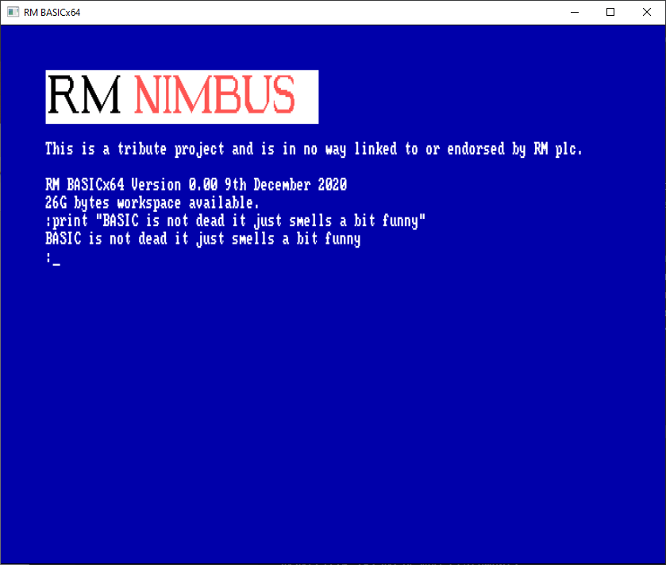

# 

_RM BASICx64 is a tribute project and is in no way linked to or endorsed by RM plc._

## About

The plan is to re-implement the RM Basic interpeter and code editor (originally implemented on the [RM Nimbus PC186](https://en.wikipedia.org/wiki/RM_Nimbus) in the 1980s) for modern 64-bit machines.  RM BASICx64 is written in Go and uses the [Nimbgobus](https://github.com/adamstimb/nimgobus) extension for [ebiten game engine](https://ebiten.org) to simulate the inputs and outputs of the RM Nimbus.

High-level goals:

- Backwards compatibility - enable crusties like me to run their old RM Basic programs on a modern computer without emulation and the severe resource limitations of the original platform
- Get on the internet - extend the dialect to handle http requests
- Authentic 1980s user experience - recreate the original code editor, but also support easy-to-use modern editors such as VSCode

## Functionality

Still laying the ground work.  Some features work, some don't, some aren't implemented yet.

### Screenshot
# 

## Links

- [Ebiten](https://ebiten.org/) - A dead simple 2D game library for Go
- [nimgobus](https://github.com/adamstimb/nimgobus) - An RM Nimbus-inspired Ebiten extension for building retro apps and games in Go
- [Crafting Interpreters](https://craftinginterpreters.com/) - Much of the scanning code was inspired by the examples in this book
- [Writing an Interpreter in Go](https://interpreterbook.com/) - The parsing code was inspired by the examples in this book
- [Facebook](https://www.facebook.com/RMNimbus/) - RM Nimbus facebook group
- [Center for Computing History](http://www.computinghistory.org.uk/) - original RM Nimbus manuals and technical data
- [Center for Computing History - RM Nimbus PC (Later Beige Model)](http://www.computinghistory.org.uk/det/41537/RM-Nimbus-PC-(Later-Beige-Model)/) - online exhibit
- [The Nimbus Museum](https://thenimbus.co.uk/) - online museum that looks like the Welcome Disk!
- [RM Nimbus](https://en.wikipedia.org/wiki/RM_Nimbus) - Wikipedia article
- [mame](https://www.mamedev.org/) - comprehensive retro computer emulation project
- [Nimbusinator](https://github.com/adamstimb/nimbusinator) - the Pythonic predecessor to Nimgobus
- [Ironstone Innovation](https://ironstoneinnovation.eu) - what I do for a living