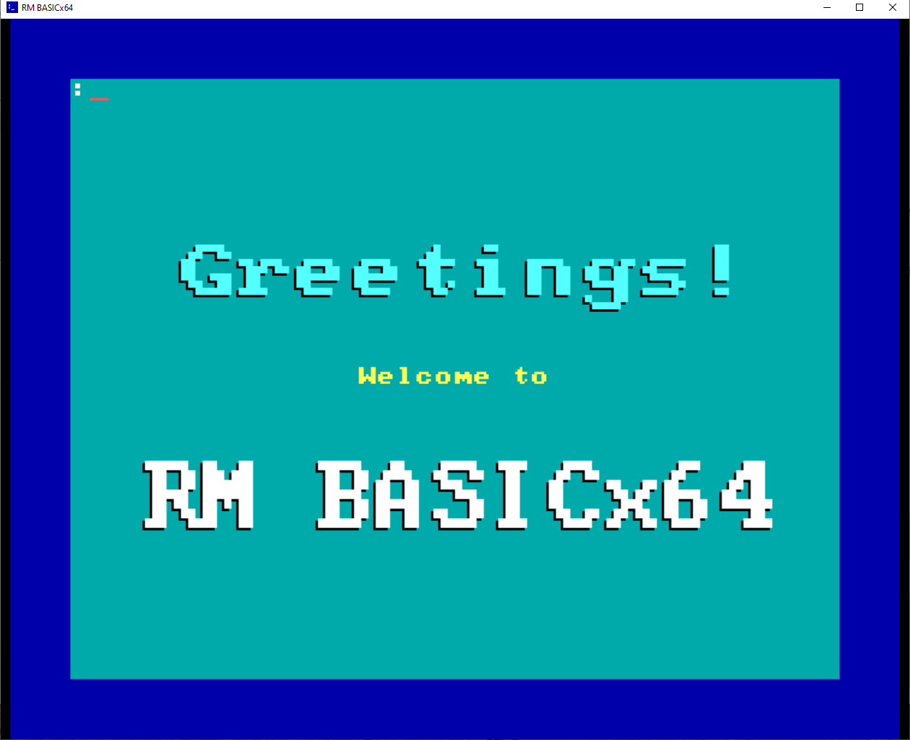

# RM BASICx64

_RM BASICx64 is a tribute project and is in no way linked to or endorsed by RM plc._

# It's a what now?

RM BASICx64 is a re-implementation the RM Basic language developed by Research Machines in 1984 for the [RM Nimbus PC-186](https://en.wikipedia.org/wiki/RM_Nimbus), used in schools and universities throughout the UK and beyond in the 1980s.  

RM BASICx64 looks and behaves like the original interpreter, but under the hood it takes full advantage of modern computer architectures by supporting 64 bit floating point numbers, extremely deep expression evaluation, and vast amounts of workspace memory.  It's faster too!

Check out the [screenshots](#screenshots).

## Ok, but why?

This is a project to resurrect an ambitious and long-forgotten BASIC dialect. RM Basic was designed specifically to provide easy access to unique graphics and sound features of the RM Nimbus; on the flipside this meant it could only run on the Nimbus.  Unlike Acorn, Spectrum and other platforms found in schools, RM never targeted consumer markets, which meant that it never had a scene or following, so when the Nimbus was eventually phased out of schools, RM Basic went with it, consigned to the skip.

Those of us who learned programming on the Nimbus and spent many a rainy lunch break fiddling around with graphics, sound, making chromatically-challenging mouse driven menus and eventually made a living doing that sort of thing, might think this a shame.  Other dialects and platforms have gone on to have a life of their own, in particular [BBC BASIC](https://en.wikipedia.org/wiki/BBC_BASIC) - so why not RM Basic?

RM BASICx64 implements the original RM Basic language specification and emulates the Nimbus sound and graphics in an easy-to-install application that runs happily on Windows, Linux or macOS.  This means you can be up and running, writing and sharing programs in a few clicks.  Now RM Basic can be enjoyed by anyone with an interest retro-computing, old DOS games, obscure antique software, oddware, all that good stuff.

## Status

Over half of the original language specification is implemented.  The code has not been hardened so may crash unexpectedly or produce strange errors.  Click the "Watch" button on the top right to get notifications of new releases!

## I want it now!

Ok, but don't say I didn't warn you.  A Windows installer can be downloaded from the [RM BASICx64 website](https://adamstimb.github.io/rmbasicx64site/).  

Alternatively you can build RM BASICx64 from source on Windows, Linux or macOS:

### Prerequisites

- Latest version of [Go](https://golang.org/doc/install)
- [Git for Windows](https://gitforwindows.org/) (GITBASH) (if using Windows)

### Build

Open (GIT)BASH and clone this repository:

```bash
git clone https://github.com/adamstimb/rmbasicx64.git
```

Change directory and run the build script for your operating system:

```bash
cd rmbasicx64
cd scripts
./build-linux.sh    # To build a Linux executable, or...
./build-windows.sh  # ... to build a Windows .exe, or...
./build-this.sh     # ... attempt to build on the current platform if neither Winoows nor Linux
```

If you're running Linux, you can run the executable straight away:

```bash
../build/rmbasicx64
```

If you're running Windows a file called `rmbasicx64.exe` will appear in the `build\` folder.

Use File Explorer to make a new folder called `rmbasicx64` in `C:\Program Files` and move the `rmbasicx64.exe` file into it.  Double-click `rmbasicx64.exe` to run.

If you get a message saying "Windows protected your PC" click "More info" then "Run anyway".

# Screenshots


The Nimbus-esque welcome screen


Ready for commands


Saying hello with big fonts


The Mandelbrot Set


A stupid meme

## Links

- [Ebiten](https://ebiten.org/) - A dead simple 2D game library for Go
- [Crafting Interpreters](https://craftinginterpreters.com/) - The scanner code was inspired by the examples in this book
- [Writing an Interpreter in Go](https://interpreterbook.com/) - The parser code was inspired by the examples in this book
- [Facebook](https://www.facebook.com/RMNimbus/) - RM Nimbus facebook group
- [Center for Computing History](http://www.computinghistory.org.uk/) - original RM Nimbus manuals and technical data
- [Center for Computing History - RM Nimbus PC (Later Beige Model)](http://www.computinghistory.org.uk/det/41537/RM-Nimbus-PC-(Later-Beige-Model)/) - online exhibit
- [The Nimbus Museum](https://thenimbus.co.uk/) - online museum that looks like the Welcome Disk!
- [RM Nimbus](https://en.wikipedia.org/wiki/RM_Nimbus) - Wikipedia article
- [mame](https://www.mamedev.org/) - comprehensive retro computer emulation project
- [Ironstone Innovation](https://ironstoneinnovation.eu) - what I do for a living
