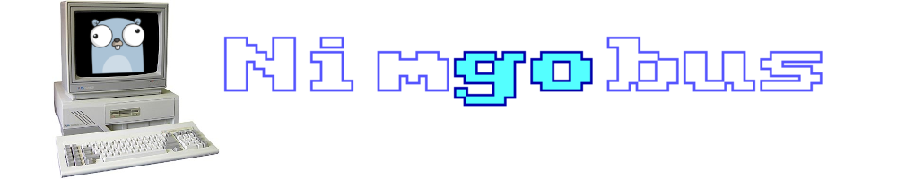
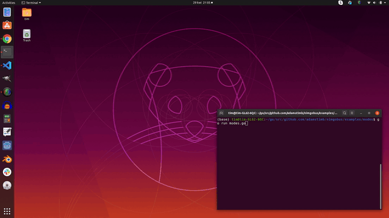
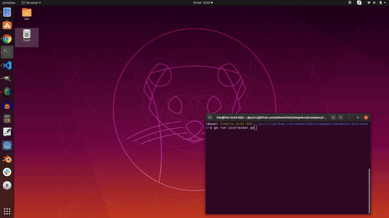

# 

An RM Nimbus-inspired [Ebiten](https://ebiten.org/) extension for building retro apps and games in Go.

_Nimgobus is a tribute project and is in no way linked to or endorsed by RM plc._

## About

Nimgobus is an extension of the excellent [Ebiten](https://ebiten.org/) game engine.  It mimicks the 16-bit graphics and text drivers of the [RM Nimbus PC186](https://en.wikipedia.org/wiki/RM_Nimbus), found in classrooms all over the UK in the 1980s and early 90s.  With Nimgobus you can develop Go applications that have the cheesey and often 'chromatically challenging' look and feel of classic Nimbus software such as PaintSPA, Ourfacts and Caxton Press.  However, it is _not_ an emulation of the Nimbus itself.  This means you get the best of both worlds:

- Cutting-edge Go computing power, beautifully presented in up to 16 colours
- Build for Linux, Windows, Mobile and Web thanks to Ebiten's cross-platform support
- Embed a Nimbus as a component within another user interface (if you really want to go nuts)

## Usage

Nimgobus generates a screen image that can be embedded in an Ebiten application.  First add Nimgobus to your Game struct:

```go
type Game struct {
	count           int
	// ...
	nimgobus.Nimbus // Embed the Nimbus in the Game struct
}
```

In your `NewGame()` function, initialize the Nimbus before sending any commands to it:

```go
func NewGame() *Game {
	game := &Game{}
	// ...
	game.Init() // Initialize Nimgobus
	return game
}
```

In the `Update()` function add a call to update the Nimbus monitor screen:

```go
func (g *Game) Update() error {
	// ...
	g.Nimbus.Update() // Update the app on all subsequent iterations
	// ...
	return nil
}
```

The Nimbus screen can be retrieved like this:

```go
img := g.Monitor
```

And commands sent like this:

```go
g.Cls()
g.Print("Even a stopped clock gives the right time twice a day.")
```

See the [examples](#Examples) below for working examples to get you started.

### Syntax

For the sake of authenticity the syntax used in nimgobus is influenced by RM Basic (the Basic interpreter supplied with the original Nimbus), including the way screen coordinates are handled. It is therefore highly recommended to read the original documentation for RM Basic (see [links](#Links)).

Some commands have been implement in nimgobus in exactly they same way as in RM Basic.  Optional arguments, which were used extensively in RM Basic (for example BRUSH, DIRECTION, FONT in the PLOT command) are not so easily reproduced because Go does not support functions with optional parameters. Where optional parameters are used by functions in RM Basic, nimgobus instead accepts an 'options' struct as a parameter. In some cases this has rendered obsolete RM Basic features that set default values for BRUSH, FONT, etc.

## Examples

[greeting.go](examples/greeting/greeting.go)


[modes.go](examples/modes/modes.go)



[isstracker.go](examples/isstracker/isstracker.go)



## Acknowledgements

Thanks to [Peter Hellberg](https://github.com/peterhellberg) for suggestions and improvements.

## Links

- Masthead gopher generated by [gopherize.me](https://gopherize.me/) and Nimbus photograph from [The Nimbus Museum](https://www.thenimbus.co.uk/range-of-nimbus-computers)
- [Ebiten](https://ebiten.org/)
- [Facebook](https://www.facebook.com/RMNimbus/) - RM Nimbus facebook group
- [Center for Computing History](http://www.computinghistory.org.uk/) - original RM Nimbus manuals and technical data
- [Center for Computing History - RM Nimbus PC (Later Beige Model)](http://www.computinghistory.org.uk/det/41537/RM-Nimbus-PC-(Later-Beige-Model)/) - online exhibit
- [The Nimbus Museum](https://thenimbus.co.uk/) - online museum that looks like the Welcome Disk!
- [RM Nimbus](https://en.wikipedia.org/wiki/RM_Nimbus) - Wikipedia article
- [mame](https://www.mamedev.org/) - comprehensive retro computer emulation project
- [Freesound pack: Floppy disk drive](https://freesound.org/people/MrAuralization/packs/15891/) - source of the floppy drive sounds
- [Nimbusinator](https://github.com/adamstimb/nimbusinator) - the Pythonic predecessor to Nimgobus
- [Ironstone Innovation](https://ironstoneinnovation.eu) - what I do for a living
